# Corporacion Favorita Sales Forecasting
## Project Introduction
This is a Kaggle competition, where we use **Time Series Forecasting** to forecast store sales on data from Corporación Favorita, a large Ecuadorian based grocery retailer.
A key factor in a company’s retail performance is the ability to properly estimate sales and manage inventories. 
The main challegnge, as with any retailer, is predicting the sales and inventory requirements for each location to avoid overstocking and understocking, allowing the business to offer the greatest customer service while reducing losses and guaranteeing the store’s sustainability.

In this project, we explore historical sales data provided by **Corporación Favorita** and employ time series analysis techniques to understand trends, patterns, and seasonality in the data. By leveraging machine learning algorithms, we aim to develop a robust forecasting model that can help Corporación Favorita optimize its inventory and enhance customer satisfaction.

The scope, is to build a model that more accurately predicts the unit sales for thousands of items sold at different Corporación Favorita stores and practice machine learning skills with an approachable training dataset of dates, store, and item information, promotions, and unit sales.

Competition Link: [Kaggle Competition Time Series Forecasting](https://www.kaggle.com/c/favorita-grocery-sales-forecasting/overview)

## Evaluation Metric
The evaluation metric is the Normalized Weighted Root Mean Squared Logarithmic Error (NWRMSLE).

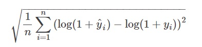

where:
+ n - is the total number of instances
+ y^i - is the predicted value of the target for instance (i)
+ yi - is the actual value of the target for instance (i)
+ log - is the natural logarithm

## Dataset Description

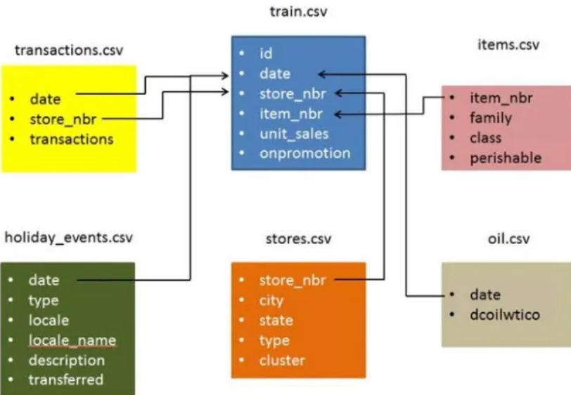

The dataset consists of 6 different files.

+ **Train**: The training data, comprising time series of features store_nbr, family, and onpromotion as well as the target sales
+ **Test**: The test data, having the same features as the training data
+ **Transactions**: Contains date, store_nbr and transaction made on that specific date
+ **Stores**: Store metadata, including city, state, type, and cluster
+ **Holidays Events**: Holidays and Events, with metadata
+ **Oil**: Daily oil price which includes values during both the train and test data timeframes. (Ecuador is an oil-dependent country and its economic health is highly vulnerable to shocks in oil prices)

## Exploratory Data Analysis (EDA)
In this project, we conducted Exploratory Data Analysis (EDA) on the dataset provided by Corporación Favorita for their sales forecasting Kaggle competition. 

The goal of this EDA was to gain insights into the data, understand product sales patterns and identify potential features for building a robust sales forecasting model.

**Dataset overview**
| Dataset Name  | Description |
| ------------- | ------------- |
| Train Data  | Historical sales data with various features  |
| Additional Data  | Holiday Events, oil price, store details, transcactions  |

Corporacion Favorita uses data visualization to detect large scale trends in their sales and to spot the effect of unexpected behaviour caused by special events. 
The **Sales data** from the train dataset spanning the period from 2013-01-01 to 2017-08-15,	indicates a consistent trend of sales growth over time. By analyzing the sales figures and using visualizations such as  matplotlib across multiple years, it becomes evident that company's performance has exhibited an upward trajectory, reflecting increasing demand.

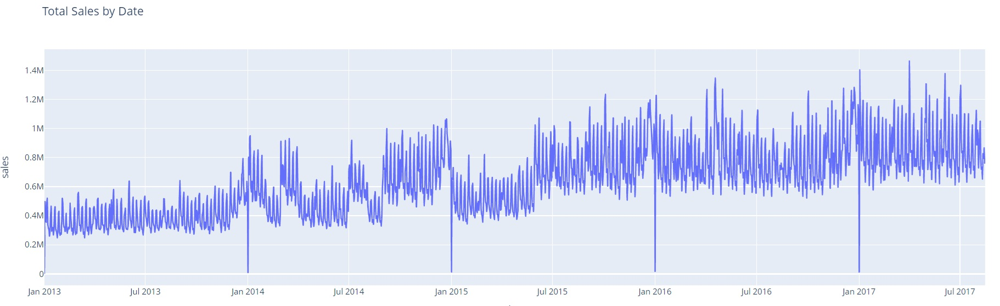

**Sales Analysis by Year**

Our analysis of the sales data from Corporación Favorita's stores reveals a significant upward trend in sales over the period from 2013 to 2017. The data was extracted from the train dataframe, which contains sales records along with other relevant features.

To quantify this trend, we grouped the sales data by year and calculated the total sales for each year. The results show a consistent year-over-year increase in total sales, indicating a robust growth trajectory for the company during this period. We have to stress that the available data for 2017, goes up to 08/2017.

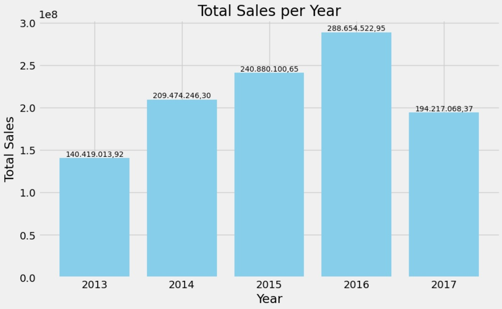

**Average Sales by Month**

Our analysis of the sales data from Corporación Favorita's stores on a monthly basis, reveals a significant utrend in sales in the months December, January, July amd March, over the period from 2013 to 2017 and in particular July and December have the highest unit sales compared to other months.

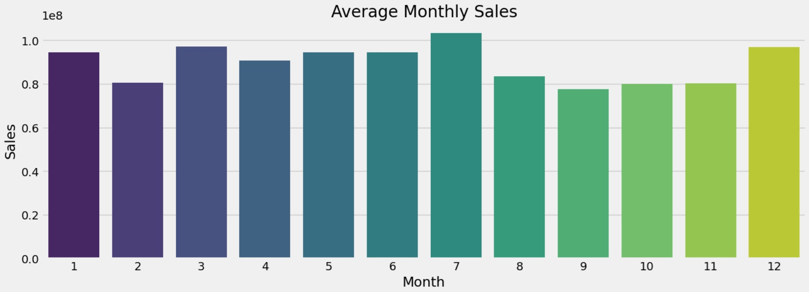

**Sales Analysis by Day of the Week**

We analyzed the sales data to understand the distribution of sales across different days of the week. The results indicate that sales tend to peak during the weekend, particularly on Saturdays and Sundays.
Sales volumes show a noticeable increase during Saturdays and Sundays compared to weekdays. This suggests that customers are more active and tend to make larger purchases during the weekend, possibly due to factors such as increased leisure time, family outings, or shopping trips.

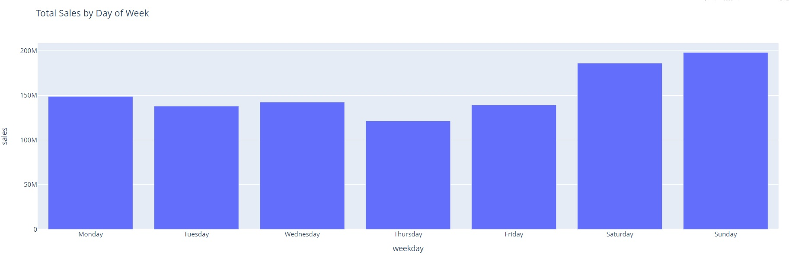

**Average Sales Per Store**

We conducted an analysis of sales data to determine the average sales performance across different stores. We did it by combining the train data and the store details data, for the total available period. The findings provide insights into the revenue generation capabilities of each store and help identify potential areas for improvement or optimization. We identified Store 44 as the top-performing store throughout the available time period based on its consistently high sales performance.

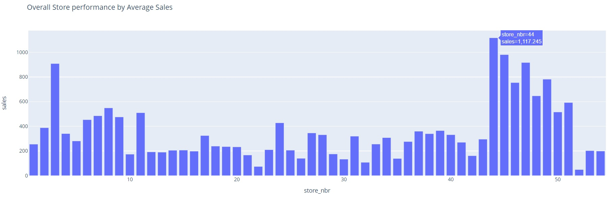

**Top 10 Product Families based on Sales**

With the groundwork laid, the analysis focused on identifying the family product categories with the highest sales. The results of this visualization underscore the top-performing family product categories in terms of sales. Notably, categories such as ‘Grocery,’ ‘Beverages,’ ‘Produce,’ ‘Cleaning,’ ‘Daily,’ ‘Dairy,’ and ‘Bakery’ consistently achieve higher average sales compared to others. These categories play a pivotal role in contributing to the overall store’s sales revenue.

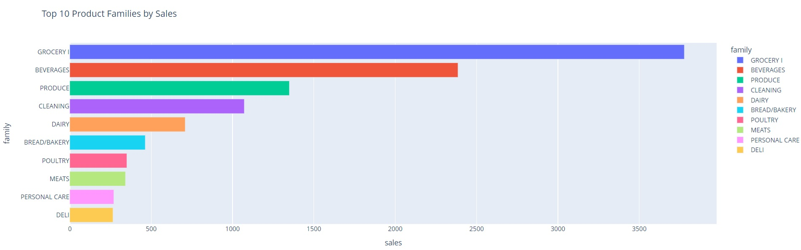

In the same manner we can plot the share of the every product family to total sales for the total available period. We can derive that more than 31% of the total sales comes from the grocery product family, making it a value information for our analysis.

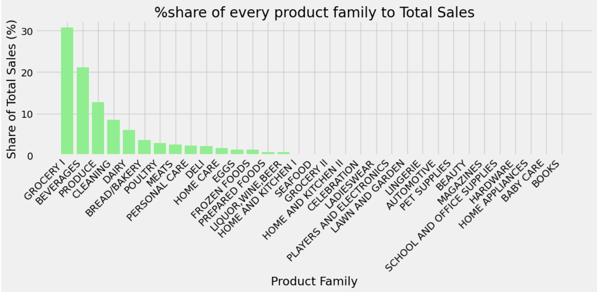

**Promotions and Sales**

Promotions play a crucial role in influencing sales at Corporación Favorita retail stores. The analysis reveals a significant increase in sales when products are on promotion. By looking at the product families, we can identify which product families are most affected by promotions. The darker shades on product families - produce, grocery I, beverages, cleaning, indicate that promotions have a significant impact on sales for those product families.

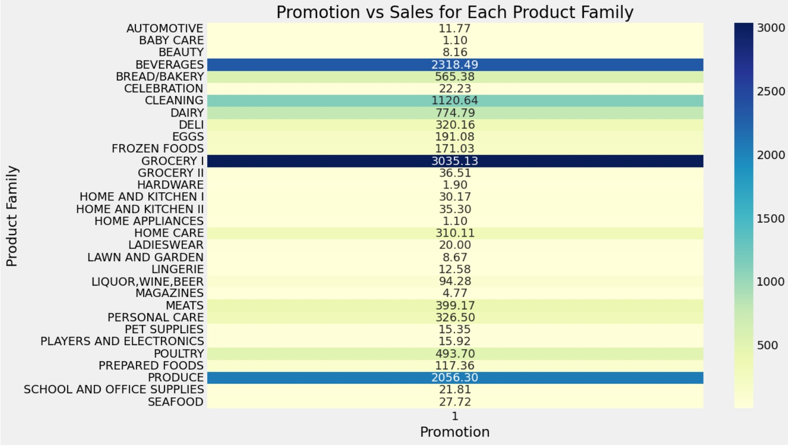

**Relationship Between Sales and Oil Prices**

The analysis indicates a significant relationship between the evolution of sales at Corporación Favorita and the fluctuations in oil prices. Ecuador, being heavily dependent on oil exports, experiences a direct impact on its economy due to changes in oil prices. This dependency is reflected in consumer behavior and, consequently, in the sales trends observed at Corporación Favorita.

The visualization below demonstrates this relationship allowing for a clearer comparison over the period from 2013 to 2017. As the price of oil fluctuates, corresponding changes in sales patterns are evident, highlighting the sensitivity of the retail sector to macroeconomic factors.

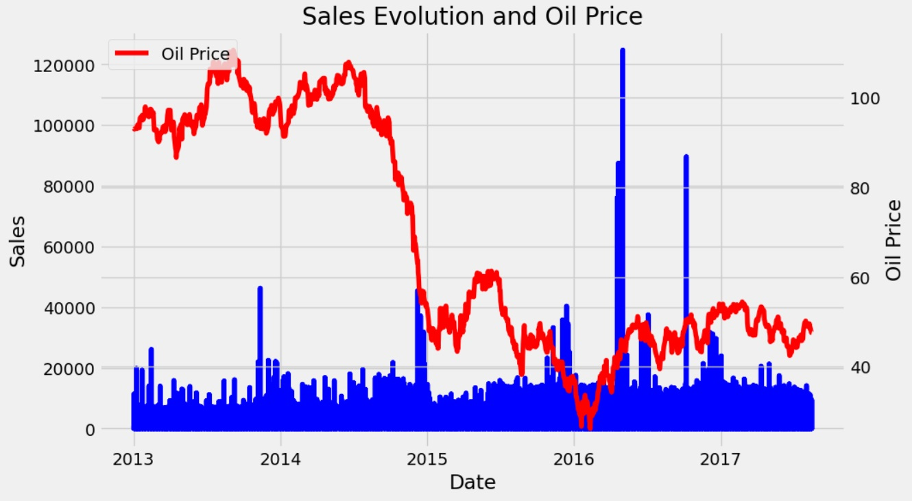

**% of share on sales per State and City**

It is interesting to ratiocinate the findings of the following graph and indeed what we observe from the graph makes total sense. The cities with the most stores are Guayaquil and Quito, since Guayaquil is the largest region in Ecuador and Quito is the capital of Ecuador.Therefore the state of Pichincha with the capital city of Quito, share the largest amount of sales for Corporación Favorita.

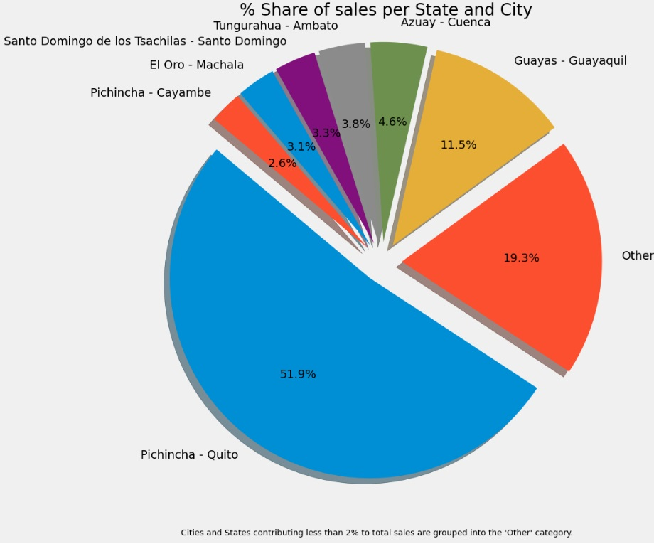
