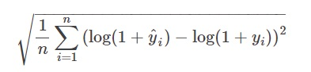
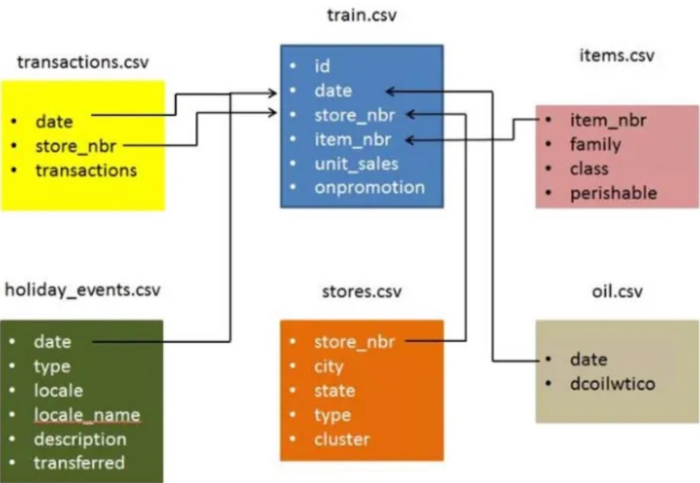

# Corporacion Favorita Sales Forecasting
## Project Introduction
This is a Kaggle competition, where we'll use **Time Series Forecasting** to forecast store sales on data from Corporación Favorita, a large Ecuadorian based grocery retailer.
A key factor in a company’s retail performance is the ability to properly estimate sales and manage inventories. 
The main challegnge, as with any retailer, is predicting the sales and inventory requirements for each location to avoid overstocking and understocking, allowing the business to offer the greatest customer service while reducing losses and guaranteeing the store’s sustainability.

In this project, we explore historical sales data provided by **Corporación Favorita** and employ time series analysis techniques to understand trends, patterns, and seasonality in the data. By leveraging machine learning algorithms, we aim to develop a robust forecasting model that can help Corporación Favorita optimize its inventory and enhance customer satisfaction.

The scope, is to build a model that more accurately predicts the unit sales for thousands of items sold at different Corporación Favorita stores and practice machine learning skills with an approachable training dataset of dates, store, and item information, promotions, and unit sales.

Competition Link: [Kaggle Competition Time Series Forecasting](https://www.kaggle.com/c/favorita-grocery-sales-forecasting/overview)

## Evaluation Metric
The evaluation metric is the Normalized Weighted Root Mean Squared Logarithmic Error (NWRMSLE).

where:
+ n - is the total number of instances
+ y^i - is the predicted value of the target for instance (i)
+ yi - is the actual value of the target for instance (i)
+ log - is the natural logarithm

## Dataset Description

